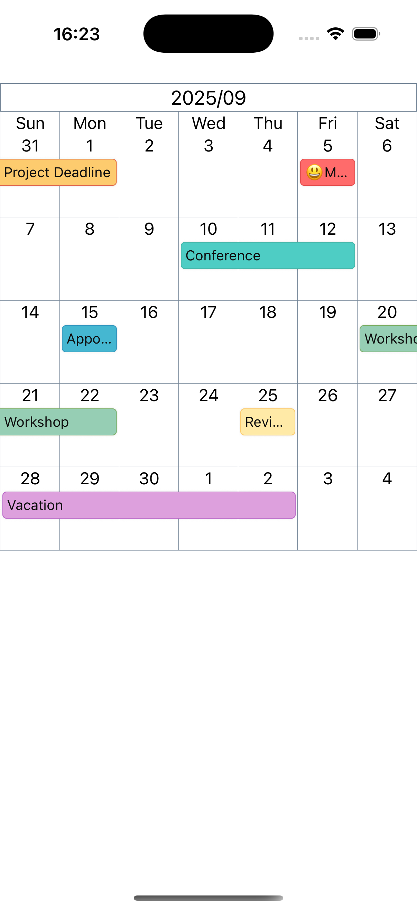

# react-native-ll-calendar

A horizontally scrollable monthly calendar component for React Native with event support.



## Installation

```sh
npm install react-native-ll-calendar
```

or

```sh
yarn add react-native-ll-calendar
```

## Usage

```tsx
import { MonthCalendar, CalendarEvent } from 'react-native-ll-calendar';

const events: CalendarEvent[] = [
  {
    id: '1',
    title: 'Meeting',
    start: new Date(2025, 9, 5),
    end: new Date(2025, 9, 5),
    backgroundColor: '#ff6b6b',
    borderColor: '#e55353',
    color: '#0e0e0e',
  },
  {
    id: '2',
    title: 'Conference',
    start: new Date(2025, 9, 10),
    end: new Date(2025, 9, 12),
    backgroundColor: '#4ecdc4',
    borderColor: '#45b7aa',
    color: '#0e0e0e',
  },
];

function App() {
  const [date, setDate] = useState(new Date());

  return (
    <MonthCalendar
      defaultDate={date}
      weekStartsOn={1}
      onChangeDate={(newDate) => setDate(newDate)}
      events={events}
      onPressEvent={(event) => console.log('Event pressed:', event.title)}
      onPressCell={(date) => console.log('Cell pressed:', date)}
    />
  );
}
```

## API

### MonthCalendar Props

| Prop | Type | Required | Default | Description |
|------|------|----------|---------|-------------|
| `defaultDate` | `Date` | Yes | - | Initial date to display |
| `weekStartsOn` | `0 \| 1` | No | `0` | Week start day (0 = Sunday, 1 = Monday) |
| `onChangeDate` | `(date: Date) => void` | No | - | Callback when month changes |
| `events` | `CalendarEvent[]` | Yes | - | Array of calendar events |
| `onPressEvent` | `(event: CalendarEvent) => void` | No | - | Callback when event is pressed |
| `onPressCell` | `(date: Date) => void` | No | - | Callback when date cell is pressed |

### CalendarEvent

| Property | Type | Required | Description |
|----------|------|----------|-------------|
| `id` | `string` | Yes | Unique identifier |
| `title` | `string` | Yes | Event title |
| `start` | `Date` | Yes | Start date |
| `end` | `Date` | Yes | End date |
| `backgroundColor` | `string` | Yes | Background color |
| `borderColor` | `string` | Yes | Border color |
| `color` | `string` | Yes | Text color |

## Features

- Horizontally scrollable month view
- Multi-day event support
- Customizable event colors
- Event and date cell press handlers
- Configurable week start day (Sunday or Monday)
- Spans 10 years before and after the default date

## License

MIT

---

Made with [create-react-native-library](https://github.com/callstack/react-native-builder-bob)
