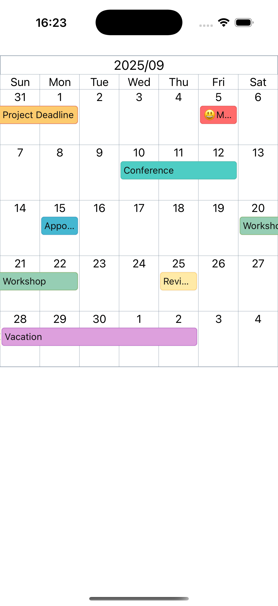

# react-native-ll-calendar

A collection of horizontally scrollable calendar components for React Native with event support.

- **MonthCalendar** — month view, swipe left/right to change months
- **ResourcesCalendar** — resource × date grid, horizontal scroll across a date range
- **WeekResourcesCalendar** — resource × date grid, swipe left/right to change weeks



## Installation

```sh
npm install react-native-ll-calendar
```

or

```sh
yarn add react-native-ll-calendar
```

## Usage

```tsx
import { useState, useRef } from 'react';
import { View, Button } from 'react-native';
import dayjs from 'dayjs';
import { MonthCalendar, CalendarEvent, MonthCalendarRef } from 'react-native-ll-calendar';

const events: CalendarEvent[] = [
  {
    id: '1',
    title: 'Meeting',
    start: new Date(2025, 9, 5),
    end: new Date(2025, 9, 5),
    backgroundColor: '#ff6b6b',
    borderColor: '#e55353',
    color: '#0e0e0e',
  },
  // ... more events
];

function App() {
  const [date, setDate] = useState(new Date());
  const calendarRef = useRef<MonthCalendarRef>(null);

  const handleScrollToTop = () => {
    // Scroll to the top of the current month view
    calendarRef.current?.scrollMonthViewToOffset(
      dayjs(date).format('YYYY-MM'),
      0,
      true
    );
  };

  const checkRowHeight = () => {
    // Get the height of the row containing the specific date
    const height = calendarRef.current?.getMonthRowHeight(
      dayjs(date).format('YYYY-MM'),
      new Date()
    );
    console.log('Row height:', height);
  };

  return (
    <View style={{ flex: 1 }}>
      <View style={{ flexDirection: 'row', justifyContent: 'space-around', padding: 10 }}>
        <Button title="Scroll Top" onPress={handleScrollToTop} />
        <Button title="Check Height" onPress={checkRowHeight} />
      </View>
      <MonthCalendar
        ref={calendarRef}
        defaultDate={date}
        weekStartsOn={1}
        onChangeDate={(newDate) => setDate(newDate)}
        events={events}
        onPressEvent={(event) => console.log('Event pressed:', event.title)}
        // ... other props
      />
    </View>
  );
}
```

## API

### MonthCalendar Props

| Prop                        | Type                                    | Required | Default | Description                                |
| --------------------------- | --------------------------------------- | -------- | ------- | ------------------------------------------ |
| `defaultDate`               | `Date`                                  | Yes      | -       | Initial date to display                    |
| `weekStartsOn`              | `0 \| 1`                                | No       | `0`     | Week start day (0 = Sunday, 1 = Monday)    |
| `onChangeDate`              | `(date: Date) => void`                  | No       | -       | Callback when month changes                |
| `events`                    | `CalendarEvent[]`                       | Yes      | -       | Array of calendar events                   |
| `onPressEvent`              | `(event: CalendarEvent) => void`        | No       | -       | Callback when event is pressed             |
| `onLongPressEvent`          | `(event: CalendarEvent) => void`        | No       | -       | Callback when event is long pressed        |
| `delayLongPressEvent`       | `number`                                | No       | -       | Delay in ms before long press is triggered |
| `onPressCell`               | `(date: Date) => void`                  | No       | -       | Callback when date cell is pressed         |
| `onLongPressCell`           | `(date: Date) => void`                  | No       | -       | Callback when date cell is long pressed    |
| `delayLongPressCell`        | `number`                                | No       | -       | Delay in ms before long press is triggered |
| `onRefresh`                 | `() => void`                            | No       | -       | Callback for pull-to-refresh               |
| `refreshing`                | `boolean`                               | No       | -       | Whether the calendar is refreshing         |
| `dayCellContainerStyle`     | `(date: Date) => ViewStyle`             | No       | -       | Style function for day cell container      |
| `dayCellTextStyle`          | `(date: Date) => TextStyle`             | No       | -       | Style function for day cell text           |
| `todayCellTextStyle`        | `TextStyle`                             | No       | -       | Style for today's cell text                |
| `locale`                    | `ILocale`                               | No       | -       | Locale configuration for date formatting   |
| `weekdayCellContainerStyle` | `(weekDayNum: WeekdayNum) => ViewStyle` | No       | -       | Style function for weekday cell container  |
| `weekdayCellTextStyle`      | `(weekDayNum: WeekdayNum) => TextStyle` | No       | -       | Style function for weekday cell text       |
| `hiddenMonth`               | `boolean`                               | No       | `false` | Hide month header display                  |
| `monthFormat`               | `string`                                | No       | -       | Custom format string for month display     |
| `stickyHeaderEnabled`       | `boolean`                               | No       | `false` | Enable sticky headers for month and week   |
| `cellBorderColor`           | `string`                                | No       | `'lightslategrey'` | Color for calendar cell borders |
| `allowFontScaling`          | `boolean`                               | No       | -       | Enable font scaling for text elements      |
| `eventHeight`               | `number`                                | No       | `26`    | Height of event items in pixels            |
| `eventTextStyle`            | `(event: CalendarEvent) => TextStyle`   | No       | -       | Style function for event text              |
| `eventEllipsizeMode`       | `'head' \| 'middle' \| 'tail' \| 'clip'` | No       | `'tail'` | Ellipsize mode for event text              |
| `renderEventOverlay`       | `(event: CalendarEvent) => React.ReactNode` | No    | -       | Optional overlay above each event (use `position: 'absolute'` with `top` / `right` / `bottom` / `left`, or `MonthCalendarEventOverlay`) |
| `bottomSpacing`            | `number`                                | No       | -       | Bottom spacing in pixels for scrollable content |

### MonthCalendarRef Methods

You can access these methods by passing a `ref` to the `MonthCalendar` component.

| Method | Signature | Description |
| ------ | --------- | ----------- |
| `scrollMonthViewToOffset` | `(monthKey: string, offset: number, animated?: boolean) => void` | Scrolls the view of the specified month (format: 'YYYY-MM') to a vertical offset. |
| `getMonthRowHeight` | `(monthKey: string, date: Date) => number \| undefined` | Returns the height of the week row containing the specified date in the specified month. |

### CalendarEvent

| Property          | Type                                    | Required | Description                    |
| ----------------- | --------------------------------------- | -------- | ------------------------------ |
| `id`              | `string`                                | Yes      | Unique identifier              |
| `title`           | `string`                                | Yes      | Event title                    |
| `start`           | `Date`                                  | Yes      | Start date                     |
| `end`             | `Date`                                  | Yes      | End date                       |
| `backgroundColor` | `string`                                | Yes      | Background color               |
| `borderColor`     | `string`                                | Yes      | Border color                   |
| `color`           | `string`                                | Yes      | Text color                     |
| `borderStyle`     | `'solid' \| 'dashed' \| 'dotted'`       | No       | Border style                   |
| `borderWidth`     | `number`                                | No       | Border width                   |
| `borderRadius`    | `number`                                | No       | Border radius                  |

---

### ResourcesCalendar Props

| Prop | Type | Required | Default | Description |
| --- | --- | --- | --- | --- |
| `fromDate` | `Date` | Yes | - | Start of the displayed date range |
| `toDate` | `Date` | Yes | - | End of the displayed date range |
| `resources` | `CalendarResource[]` | Yes | - | List of resources (rows) |
| `events` | `ResourcesCalendarEvent[]` | Yes | - | Array of resource events |
| `renderDateLabel` | `(date: Date) => JSX.Element` | No | - | Custom header date cell content |
| `renderMonthLabel` | `(year: number, month: number) => JSX.Element` | No | - | Custom month label content |
| `renderResourceNameLabel` | `(resource: CalendarResource) => JSX.Element` | No | - | Custom resource name cell content |
| `resourceColumnWidth` | `number` | No | `80` | Width of the resource name column |
| `dateColumnWidth` | `number` | No | `60` | Width of each date column |
| `onRefresh` | `() => void` | No | - | Callback for pull-to-refresh |
| `refreshing` | `boolean` | No | - | Whether the calendar is refreshing |
| `fixedRowCount` | `number` | No | `0` | Number of resource rows pinned above the scroll area |
| `onPressCell` | `(resource: CalendarResource, date: Date) => void` | No | - | Callback when a cell is pressed |
| `onLongPressCell` | `(resource: CalendarResource, date: Date) => void` | No | - | Callback when a cell is long pressed |
| `delayLongPressCell` | `number` | No | - | Delay in ms before long press is triggered |
| `onPressEvent` | `(event: ResourcesCalendarEvent) => void` | No | - | Callback when an event is pressed |
| `onLongPressEvent` | `(event: ResourcesCalendarEvent) => void` | No | - | Callback when an event is long pressed |
| `delayLongPressEvent` | `number` | No | - | Delay in ms before long press is triggered |
| `eventHeight` | `number` | No | `22` | Height of event items in pixels |
| `bottomSpacing` | `number` | No | - | Bottom spacing in pixels for scrollable content |
| `eventTextStyle` | `(event: ResourcesCalendarEvent) => TextStyle` | No | - | Style function for event text |
| `eventEllipsizeMode` | `'head' \| 'middle' \| 'tail' \| 'clip'` | No | `'tail'` | Ellipsize mode for event text |
| `renderEventOverlay` | `(event: ResourcesCalendarEvent) => ReactNode` | No | - | Optional overlay above each event |
| `dateCellContainerStyle` | `(date: Date) => ViewStyle` | No | - | Style for header date cells |
| `cellContainerStyle` | `(resource: CalendarResource, date: Date) => ViewStyle` | No | - | Style for resource day cell background |
| `hiddenMonth` | `boolean` | No | `false` | Hide the month header row |
| `allowFontScaling` | `boolean` | No | - | Enable font scaling for text elements |
| `resourceNameLayout` | `'fixed-column' \| 'inline-band'` | No | `'fixed-column'` | Layout mode for the resource name |
| `prioritizeCellInteraction` | `boolean` | No | `false` | Overlay to prioritize cell taps over events |

### CalendarResource

| Property | Type | Required | Description |
| --- | --- | --- | --- |
| `id` | `string` | Yes | Unique identifier |
| `name` | `string` | Yes | Display name |

### ResourcesCalendarEvent

Same fields as `CalendarEvent` with the addition of:

| Property | Type | Required | Description |
| --- | --- | --- | --- |
| `resourceId` | `string` | Yes | ID of the resource this event belongs to |

---

### WeekResourcesCalendar Props

| Prop | Type | Required | Default | Description |
| --- | --- | --- | --- | --- |
| `defaultDate` | `Date` | Yes | - | Initial date to display |
| `weekStartsOn` | `0 \| 1` | No | `0` | Week start day (0 = Sunday, 1 = Monday) |
| `onChangeDate` | `(date: Date) => void` | No | - | Callback when the displayed week changes |
| `resources` | `CalendarResource[]` | Yes | - | List of resources (rows) |
| `events` | `ResourcesCalendarEvent[]` | Yes | - | Array of resource events |
| `eventHeight` | `number` | No | `22` | Height of event items in pixels |
| `onPressCell` | `(resource: CalendarResource, date: Date) => void` | No | - | Callback when a cell is pressed |
| `onLongPressCell` | `(resource: CalendarResource, date: Date) => void` | No | - | Callback when a cell is long pressed |
| `delayLongPressCell` | `number` | No | - | Delay in ms before long press is triggered |
| `onPressEvent` | `(event: ResourcesCalendarEvent) => void` | No | - | Callback when an event is pressed |
| `onLongPressEvent` | `(event: ResourcesCalendarEvent) => void` | No | - | Callback when an event is long pressed |
| `delayLongPressEvent` | `number` | No | - | Delay in ms before long press is triggered |
| `prioritizeCellInteraction` | `boolean` | No | `false` | Overlay to prioritize cell taps over events |
| `eventTextStyle` | `(event: ResourcesCalendarEvent) => TextStyle` | No | - | Style function for event text |
| `eventEllipsizeMode` | `'head' \| 'middle' \| 'tail' \| 'clip'` | No | `'tail'` | Ellipsize mode for event text |
| `allowFontScaling` | `boolean` | No | - | Enable font scaling for text elements |
| `renderEventOverlay` | `(event: ResourcesCalendarEvent) => ReactNode` | No | - | Optional overlay above each event |
| `dateCellContainerStyle` | `(date: Date) => ViewStyle` | No | - | Style for header date cells |
| `cellContainerStyle` | `(resource: CalendarResource, date: Date) => ViewStyle` | No | - | Style for resource day cell background |
| `renderDateLabel` | `(date: Date) => JSX.Element` | No | - | Custom header date cell content |
| `renderResourceNameLabel` | `(resource: CalendarResource) => JSX.Element` | No | - | Custom resource name cell content |
| `onRefresh` | `() => void` | No | - | Callback for pull-to-refresh |
| `refreshing` | `boolean` | No | - | Whether the calendar is refreshing |
| `bottomSpacing` | `number` | No | - | Bottom spacing in pixels for scrollable content |
| `fixedRowCount` | `number` | No | `0` | Number of resource rows pinned above the scroll area |

---

## Features

- Horizontally scrollable month view (±10 years)
- Horizontally scrollable week resource view (±120 weeks)
- Resource × date grid view across a custom date range
- Multi-day event support with overlap stacking
- Customizable event colors and border styles
- Event press handlers (tap and long press)
- Cell press handlers (tap and long press)
- `prioritizeCellInteraction` to route taps to cells over events
- Configurable week start day (Sunday or Monday)
- Pull-to-refresh support
- Fixed row pinning for resource calendars
- Custom render props for date labels, month labels, and resource names
- Event overlay support (e.g. badge counts)
- Locale support for internationalization
- Font scaling control for text elements
- Customizable event height and text styles
- **Programmatic scroll control via Ref** (MonthCalendar)
- **Dynamic row height retrieval via Ref** (MonthCalendar)

## License

MIT

---

Made with [create-react-native-library](https://github.com/callstack/react-native-builder-bob)
